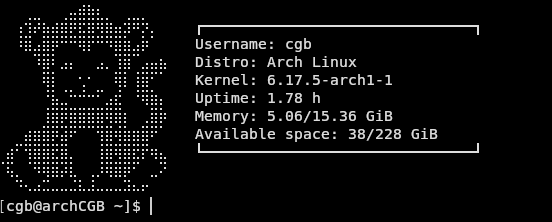

# smallFetch

**smallFetch** is a small, personal project created to learn and experiment with Rust. It's inspired by `neofetch` and displays basic system information in the terminal, but the main goal is to explore Rust programming concepts in a fun way.

---

## ⚙️ Features

- Displays basic system information (OS, kernel, uptime, etc.)
- Lightweight and simple
- Written entirely in Rust as a learning exercise

---

## 🛠️ Installation

To build and run `rustFetch` from source:

```bash
git clone https://github.com/CGB145/rustFetch.git
cd rustFetch

# Run directly with Cargo
cargo run

# Or build a release version and run
cargo build --release
./target/release/rustFetch


